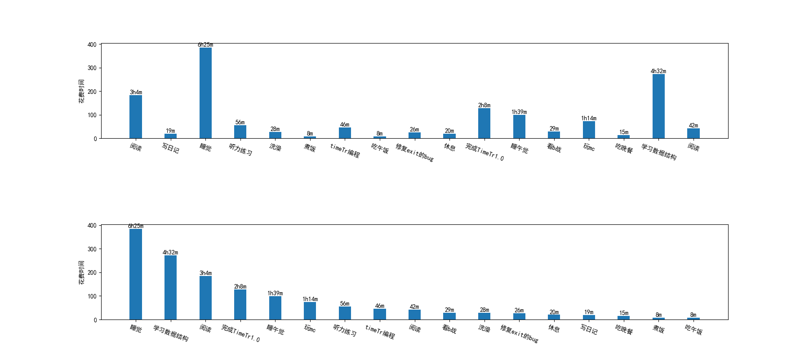
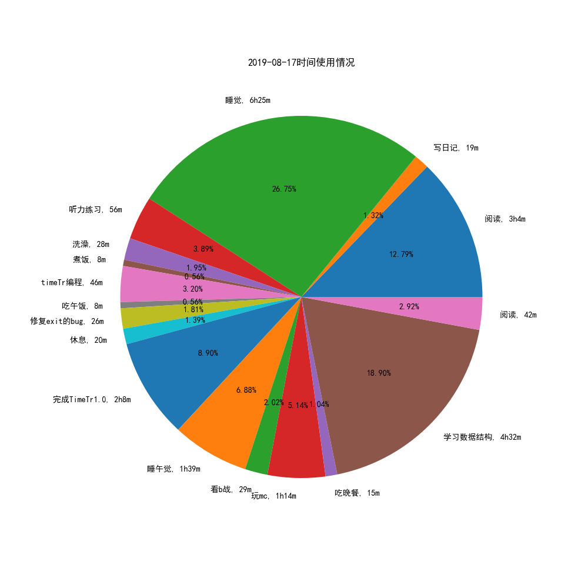
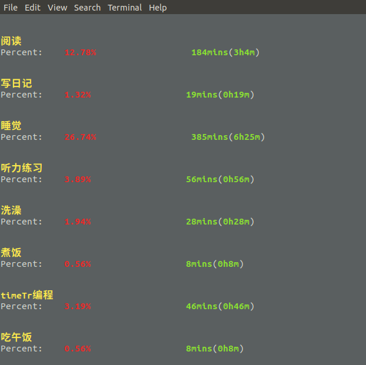

# Time Tracking Script(时间跟踪脚本)
0. 安装
- 只支持python3, 同时需要安装matplotlib依赖
- 系统需安装好中文字体SimHei, 否则图片无法正确显示中文
- clone项目到任意目录, 给予time_tracking.py执行权限
- 在项目的根目录下运行 ./time_tracking.py即可运行

1. 简介
* 通过简洁的日志语法记录自己每项日常活动, 脚本会计算出每项活动的花费时间和百分比,用户可以通过文本, 柱状图和饼状图的形式了解自己的时间使用情况, 根据数据改进自己的时间管理.

2. 目录结构
```bash
time_tracking/ 
├── or_log.txt #原始的活动记录记录文件
├── output	
│   ├── Bar # 存储柱状图的文件夹
│   │   └── 2019-08-17.png
│   ├── log.txt # 历史活动记录文件
│   └── Pie	#存储饼状图的文件夹
│       └── 2019-08-17.png
├── README.md
└── time_tracking.py #time_tracking脚本

```
2. 用法
- 按照or_log格式要求, 使用任意的文本编辑器或笔记app, 比如ios的备忘录, Google keep甚至是微信聊天记录来纪录自己的日常活动, 只要符合or_log的格式要求就行了.
- 打开or_log.txt, 删除里面全部的内容, 将记录好的日常活动粘贴进去
- 运行time_tracking.py, 就能见到操作界面

3. 选项介绍
- Checkout Time Tracking of Today, 在终端显示时间使用情况
- Show Bar, 通过柱状图展示时间使用情况, 包括按活动时间顺序展示和按活动时间长度展示的图片.
- Show Pie, 通过饼状图展示时间使用情况
- Generate..., 生成两个种图片, 保存今日的活动情况log文件中.


# or_log.txt的格式
```bash
# 每一项活动占一行
# [开始时间 结束时间 活动名称], 用一个或多个空格相隔开, 取值是00:00 ---- 23:59
# @可以来代表上一项活动的结束时间
# 比如下面的 [@ 03:23 写日记] 等价于 [03:04 03:23 写日记] 
# 多项活动用 "."连接, [desc1.desc2.desc3]
#比如[09:48 10:44 听力练习.阅读HackerNews]

00:00 03:04 阅读
@ 03:23 写日记
...
@ 09:40 睡觉
09:48 10:44 听力练习.阅读HackerNews
@ 23:59 阅读 #00:00应该归属到第二天去


```

# log.txt的格式
```bash
#日期1
#纪录1[Description, minutes, percent]
#纪录2[Description, minutes, percent]
#日期2
#纪录1[Description, minutes, percent]
#纪录2[Description, minutes, percent]

2019-08-17
阅读, 184, 12.78
写日记, 19, 1.32
睡觉, 385, 26.74
听力练习, 56, 3.89
洗澡, 28, 1.94
...
```

生成的图片


柱状图

饼图



